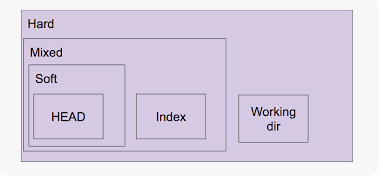
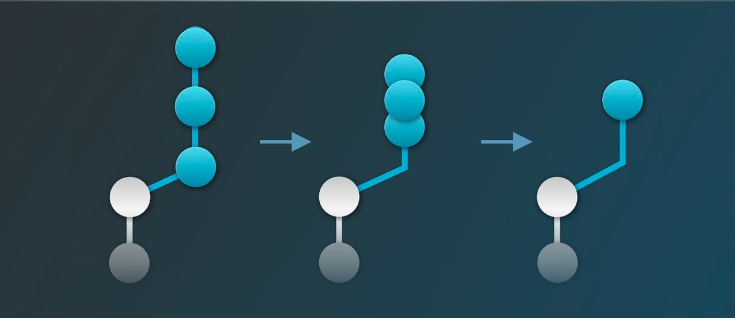
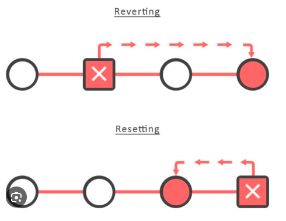
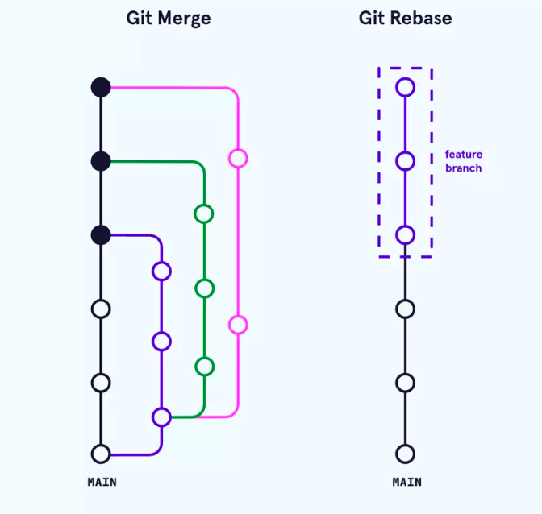
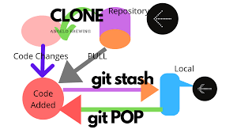

## 01.RESET


- soft: Di chuyển HEAD về commit chỉ định, nhưng giữ lại tất cả các thay đổi trong staging area. Các thay đổi sẽ trở thành staged (sẵn sàng để commit).
```bash
git reset --soft <commit>
```
Khi muốn gộp một nhóm các commit cuối cùng thành 1 commit với nội dung được chỉ định.

- mixed (mặc định): Di chuyển HEAD về commit chỉ định và xóa các thay đổi khỏi staging area, nhưng giữ lại trong working directory. Các thay đổi sẽ không còn staged.
```bash
git reset --mixed <commit>  
```
Khi muốn xem lại nhưng thay đổi của các file ở commit được chỉ định.

- hard: Di chuyển HEAD về commit chỉ định và xóa tất cả các thay đổi trong cả staging area và working directory. Lệnh này sẽ không thể khôi phục lại các thay đổi đã mất, vì vậy cần cẩn thận khi sử dụng.
```bash
git reset --hard <commit> 
```
Thường được sử dụng khi bạn muốn làm sạch cây làm việc và chỉ số, trở về một điểm biết chắc là ổn định trong lịch sử commit.

## 02.SQUASH COMMITS:

- Để gộp nhiều commit thành một commit trong Git, bạn có thể sử dụng lệnh git rebase với tùy chọn -i (interactive). Ví dụ bạn muốn gộp commit từ 1 đến 5 thành 1 commit và từ 6 đến 10 thành 1 commit.

- Dưới đây là các bước để thực hiện điều đó:

- Mở chế độ rebase tương tác:

```bash
git rebase -i HEAD~10  
```
- Lệnh này cho phép bạn xem và chỉnh sửa 10 commit gần nhất.

- Chỉnh sửa danh sách commit:
- Sau khi chạy lệnh trên, một trình soạn thảo văn bản (như Vim hoặc Nano) sẽ xuất hiện với danh sách 10 commit gần nhất. Bạn cần thay đổi các dòng commit đó như sau:

- Giữ lại dòng đầu tiên cho commit 1 và thay đổi các dòng tiếp theo từ commit 2 đến commit 5 bằng cách thay từ pick thành squash (hoặc s).
- Sau đó, giữ lại dòng commit 6 và thay đổi từ commit 7 đến 10 bằng cách cũng thay pick thành squash.

Danh sách của bạn có thể trông như thế này:

pick <hash commit 1> Commit message 1  
squash <hash commit 2> Commit message 2  
squash <hash commit 3> Commit message 3  
squash <hash commit 4> Commit message 4  
squash <hash commit 5> Commit message 5  
pick <hash commit 6> Commit message 6  
squash <hash commit 7> Commit message 7  
squash <hash commit 8> Commit message 8  
squash <hash commit 9> Commit message 9  
squash <hash commit 10> Commit message 10  

- Lưu và thoát: Sau khi chỉnh sửa xong, bạn lưu và thoát khỏi trình soạn thảo.

- Chỉnh sửa thông điệp commit: Một màn hình khác sẽ hiện ra cho phép bạn chỉnh sửa thông điệp cho các commit mới đã được gộp lại. Bạn có thể nhập lại thông điệp commit mà bạn muốn cho mỗi nhóm commit vừa gộp lại.

Hoàn tất quá trình rebase: Sau khi bạn đã chỉnh sửa thông điệp commit, lưu và thoát ra khỏi trình soạn thảo. Git sẽ hoàn tất quá trình rebase.

Sau khi hoàn tất, bạn sẽ có 2 commit mới - một cho các commit từ 1 đến 5 và một cho các commit từ 6 đến 10.

## 03.CHECKOUT AND REVERT

```bash
git checkout
```
Mục đích: Lệnh này được sử dụng để chuyển đổi nhánh hoặc khôi phục tệp trong cây làm việc về một trạng thái ở một commit cụ thể.

Cách thức hoạt động:

Khi bạn sử dụng git checkout <commit_hash>, bạn sẽ chuyển cây làm việc về trạng thái mà nó có tại commit đó. Điều này có thể dẫn đến việc bạn thay đổi tệp tin trong cây làm việc và thay đổi nhánh hiện tại, đưa bạn vào trạng thái "detached HEAD".
Ví dụ:

git checkout <commit_hash>  
Lệnh này sẽ đưa bạn đến trạng thái của commit cụ thể mà bạn chỉ định. Nếu bạn thực hiện các thay đổi ở trạng thái này và muốn ghi lại chúng, bạn sẽ cần tạo một nhánh mới.
Lưu ý: Sử dụng git checkout để quay trở lại trạng thái của cả cây làm việc có thể mất các thay đổi chưa được commit, vì nó có thể ghi đè lên chúng.

```bash
git revert
```
Mục đích: Lệnh này được sử dụng để tạo ra một commit mới mà có tác dụng đảo ngược (hoặc hủy bỏ) các thay đổi của một commit trước đó.

Cách thức hoạt động:

Khi bạn sử dụng git revert <commit_hash>, Git sẽ tạo một commits mới có nội dung ngược lại với commit mà bạn chỉ định, giữ cho lịch sử commit vẫn nguyên vẹn.
Ví dụ:

git revert <commit_hash>  
Lệnh này sẽ tạo ra một commit mới, đảo ngược tất cả các thay đổi mà commit mà bạn đã chỉ định đã thực hiện.
Lưu ý: git revert là lựa chọn an toàn hơn, đặc biệt khi làm việc với nhánh chính, vì nó không thay đổi lịch sử commit nhưng tạo ra một commit mới, điều này có thể tiện lợi trong việc duy trì lịch sử theo dõi.

Tóm tắt
git checkout: Chuyển đến trạng thái của commit cụ thể, có thể rời rạc (detached) và có thể mất thay đổi chưa được commit.
git revert: Tạo một commit mới đảo ngược các thay đổi của commit đã chỉ định, giúp giữ lịch sử commit nguyên vẹn mà không làm mất dữ liệu.


## 04.REBASE-MERGE

- Rebase giúp "kéo" tất cả các commit từ nhánh được rebase lên trên đỉnh của nhánh hiện tại, tạo ra một chuỗi commit mới và sạch sẽ hơn. Kết quả là lịch sử commit sẽ trở nên sạch hơn và dễ hiểu hơn so với việc merge thông thường. Khi rebase một nhánh vào nhánh khác, bạn đang cố gắng tích hợp các thay đổi mới nhất từ nhánh feature vào nhánh hiện tại một cách liền mạch.

```bash
git checkout feature
git rebase master
git checkout master
git merge feature
```
- Giải quyết conflict:
Để giải quyết conflict, bạn cần chỉnh sửa các file đó và quyết định giữ lại đoạn code nào hoặc kết hợp các thay đổi một cách thích hợp.
Sau khi sửa xong, bạn cần xóa các dấu <<<<<<<, =======, và >>>>>>> và các phần không cần thiết khác.
Đánh dấu conflict đã giải quyết:
Sau khi giải quyết conflict, bạn cần đánh dấu file đã được sửa:
git add <file>
Tiếp tục rebase:
Khi bạn đã giải quyết conflict và đánh dấu các file, tiếp tục rebase bằng cách sử dụng lệnh:
```bash
git rebase --continue

```

## 05.STASH

Lưu trữ thay đổi với git stash
Khi bạn muốn lưu trữ tạm thời các thay đổi chưa được commit, bạn có thể sử dụng lệnh:
```bash
git stash
```  
Áp dụng các thay đổi đã stash
Để áp dụng lại các thay đổi bạn đã stash, bạn có thể sử dụng lệnh:
```bash
git stash apply  
```
Nếu bạn muốn áp dụng các thay đổi và xóa stash đồng thời, bạn có thể sử dụng:
```bash
git stash pop  
```
Xem danh sách các stash
Để xem danh sách các stash mà bạn đã lưu, bạn có thể sử dụng lệnh:
```bash
git stash list  
```
Xóa stash
Để xóa một stash cụ thể, bạn có thể sử dụng lệnh:
```bash
git stash drop stash@{n}  
```bash
Nếu bạn muốn xóa tất cả các stash, bạn có thể sử dụng:
```bash
git stash clear  
```bash
Lưu stash cùng với message
Khi bạn stash thay đổi, bạn có thể thêm một message mô tả cho stash bằng lệnh:
```bash
git stash save "Message mô tả"  
```bash
Áp dụng stash từ vị trí cụ thể
Nếu bạn muốn áp dụng stash từ một vị trí cụ thể, bạn có thể sử dụng:
```bash
git stash apply stash@{n}  
```

## 06.CHERRY-PICK

- Cherry-pick một commit từ một nhánh khác
- Để cherry-pick (chọn một commit) từ một nhánh khác vào nhánh hiện tại, bạn cần xác định ID của commit đó (hash của commit):
```bash
git cherry-pick <commit-hash>
```  
Cherry-pick nhiều commit
Bạn cũng có thể cherry-pick nhiều commit từ một nhánh khác bằng cách chỉ định các hash của các commit cần áp dụng:
```bash
git cherry-pick <commit-hash-1> <commit-hash-2> <commit-hash-3> ...  
```
Xử lý conflict khi cherry-pick
Nếu xảy ra xung đột (conflict) trong quá trình cherry-pick, bạn sẽ cần giải quyết chúng tương tự như khi thực hiện rebase. Sau khi giải quyết xung đột, bạn sử dụng git add để đánh dấu các file đã được giải quyết, sau đó sử dụng lệnh sau để tiếp tục quá trình cherry-pick:
```bash
git cherry-pick --continue
``` 
Cherry-pick một range của commit
Bạn cũng có thể cherry-pick một dải (range) các commit bằng cách sử dụng ký tự ^ để chỉ định commit cha của dải và .. để chỉ định dải:
```bash
git cherry-pick <commit-range-start>^..<commit-range-end>

Ex: git cherry-pick abc1234^..def5678
```

## 07.AMEND 
Thay đổi thông điệp commit cuối cùng:
Nếu bạn nhận thấy thông điệp commit cuối cùng cần được chỉnh sửa:
```bash
git commit --amend -m "New commit message"
```

## 08.LOG
Sử dụng git log để xem lịch sử commit với định dạng dễ đọc
```bash
git log --oneline --graph --decorate --all
```

## 09.BLAME:
Để xem ai đã thay đổi từng dòng trong một tệp cụ thể và khi nào:
```bash
git blame filename.txt
```
## 10.Create a Branch from a Commit
```bash
git checkout -b new-branch-name commit-hash
```

## 11.Tag
- Giả sử bạn đang làm việc trên một dự án Git và muốn tạo một tag cho phiên bản phát hành 1.0.0. Đầu tiên, hãy đảm bảo bạn đang ở commit mà bạn muốn đánh dấu là phiên bản 1.0.0.
Để tạo một tag với tên "v1.0.0" cho commit hiện tại, bạn có thể sử dụng lệnh sau:
```bash
git tag v1.0.0
```
Xem danh sách các tag trong Git
Để xem danh sách các tag trong repository, bạn có thể sử dụng lệnh sau:
```bash
git tag
```  
Xem chi tiết về một tag cụ thể
Nếu bạn muốn xem thông tin chi tiết về một tag cụ thể, hãy sử dụng lệnh:
```bash
git show v1.0.0
```  
Thay v1.0.0 bằng tên tag mà bạn muốn xem.

Chia sẻ tag lên remote repository
Khi bạn đã tạo một tag và muốn chia sẻ nó với các thành viên khác trong nhóm, bạn cần đẩy tag đó lên remote repository bằng lệnh sau:
```bash
git push origin v1.0.0  
```

## 12.Config
Để đăng ký email và tên người dùng khi commit code trong Git, bạn sử dụng các lệnh sau:
Đặt tên người dùng
```bash
git config --global user.name "Tên của bạn"  
```
Đặt địa chỉ email
```bash
git config --global user.email "email@example.com" 
```

## 13.Khôi phục nhánh đã xóa:
Cách xử lý: Sử dụng git reflog để tìm hash commit sau đó sử dụng.
```bash
git reflog
git checkout -b <branch_name> <commit_hash>
```
## 14.Xóa file khỏi staging area:
Cách xử lý: Sử dụng git reset HEAD <file> để xóa file khỏi staging.


## 15.Bổ sung một số file vô commit gần nhất: 
```bash
git add file1.txt file2.txt
git commit --amend --no-edit
```

## 16.Remote repo url
```bash
git remote -v
```
```bash
git remote show origin
```

- Thêm remote repository 
```bash
git remote add origin https://github.com/user/newrepo.git
```
## 17.Git push -f

Lệnh git push -f (hoặc git push --force) được sử dụng để đẩy (push) các thay đổi từ local repository lên remote repository một cách mạnh mẽ, bất chấp lịch sử commit trên remote repository. Dưới đây là một số trường hợp bạn nên cân nhắc khi sử dụng lệnh git push -f:
- Khi bạn làm việc trên branch cá nhân của bạn và muốn chỉnh sửa lại lịch sử commit trước đó để giữ cho lịch sử commit gọn gàng và dễ đọc.
- Khi bạn muốn cập nhật remote repository với lịch sử commit mới nhất của bạn và không quan trọng đến lịch sử commit cũ.
## 18.Patch
Khi sử dụng Git Patch, bạn có thể tạo và áp dụng patch để chuyển đổi các thay đổi từ một branch hoặc commit sang một branch hoặc commit khác. Dưới đây là cách sử dụng Git Patch:

**1. Tạo Patch:**
Để tạo patch từ một commit cụ thể, bạn có thể sử dụng lệnh git format-patch:
```bash
git format-patch -1 <commit-hash>
or git format-patch HEAD~n
```
Lệnh này sẽ tạo một file patch đại diện cho commit đã chọn.

**2. Áp dụng Patch:**
Để áp dụng patch vào branch hoặc commit khác, bạn có thể sử dụng lệnh git apply:
```bash
git apply path/to/your_patch_file.patch
```
Nếu bạn muốn giữ lại thông tin về người tạo commit và thông điệp commit gốc, bạn có thể sử dụng lệnh git am thay vì git apply:
bash

```bash
git am -3 path/to/your_patch_file.patch
```


